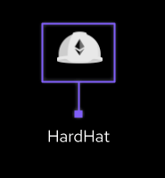

# Introdução

Esse projeto foi desenvolvido como parte do programa de formação CriptoDev da Gama Academy em parceria com a Blockchain Academy (uma empresa 2TM).

Ele formado por dois `Smart Contracts`, um para criação de um Token baseado no modelo de contrato ERC-20 e um outro contrato de uma Vending Machine, para que os usuário possam comprar e vender tokens. 

Em ambos foi utilizado `Solidity` e disponibilizados na rede de `Rede de Teste Ropsten da Ethereum`.

# Integrantes do time

[Anderson Carneiro Sousa](https://github.com/a-cs)

[Bruno Wilson](https://github.com/BruceJava1001)

[Felipe Geazi](https://github.com/FelipeGeazi)


# Apresentação
Link para a [Apresentação](https://docs.google.com/presentation/d/11QQca9wtbKaJ8p2oCyScnEl4yXuibiszd4wjzGiQfBA/edit?usp=sharing)


# Tecnologia utilizadas

[](https://docs.soliditylang.org/en/v0.8.15/)
[](https://hardhat.org/)
[](https://www.chaijs.com/)
[](https://github.com/)
[](https://code.visualstudio.com/)
[](https://web3js.readthedocs.io/en/v1.7.3/)
[](https://getwaffle.io/)
[](https://remix-project.org/)

# Instalação e operação

Clone o repositório do projeto:

```bash
git clone https://github.com/a-cs/gamacoin-cryptodev.git
```

Entre na pasta do repositório criado:

```bash
cd gamacoin-cryptodev
```

Para seguir os passos seguintes é necessário instalar o [Node Js](https://nodejs.org/en/) 

Instale as dependências:

```bash
npm install
```

Compile o código:

```bash
npx hardhat compile
```

Para rodar os testes:

```bash
npx hardhat test
```

# Funções implementadas:

## Token

1. balanceOf
2. totalSupply
3. transfer
4. transferFrom
5. mint
6. burn
7. pausable
8. activate
9. kill
___
## Vending Machine

1. availableSupply
2. withdrawEthers
3. buyingPrice
4. changeSellPrice
5. sellingPrice
6. changeBuyPrice
7. buyTokens
8. loadTokens
9. sellTokens
10. loadEthers
11. kill
 ___

# Testes Token
- Initializing
	- [x] Should return the value passed on the constructor as balance.
	- [x] The initial status should be active
	- [x] The entity that created the contract must be the owner
- Transfer
	- [x] Should only transfer if the status is active
	- [x] Should not be able to send to a non-existent wallet
	- [x] Should not be transferred if the amount is 0
	- [x] Should not be transferred if there is no balance in the wallet
	- [x] Should transfer if there is a balance in the wallet
- TransferFrom
	- [x] Should only transfer if the wallet is allowed
	- [x] Should only transfer if the status is active
	- [x] Should not be able to send to a non-existent wallet
	- [x] Should not be transferred if the amount is 0
	- [x] Should not be transferred if there is no balance in the wallet
	- [x] Should transfer if there is a balance in the wallet
- Mint
	- [x] Should only minted if the status is active
	- [x] The minted value must be greater than 0
	- [x] Only the owner can mint tokens
	- [x] Should not be able to send to a non-existent wallet
	- [x] Should increase totalSupply and wallets balance after mint
- Burn
	- [x] Should only burn if the status is active
	- [x] the wallet must have funds to burn
	- [x] Only the owner can burn tokens
	- [x] Should not be able to send to a non-existent wallet
	- [x] Should decrease totalSupply and wallets balance after burn
- Pausable
	- [x] Should not pause the contract if it is already paused
	- [x] Should not be able to pause the contract if it is not the owner
	- [x] The owner should be able to pause the contract
- Activate
	- [x] Should not pause the contract if it is already actived
	- [x] Should not be able to activate the contract if it is not the owner
	- [x] The owner should be able to activate the contract
- Kill
	- [x] Should not be able to kill if the contract is Active
	- [x] Contract should be dead after kill

___
# Testes Vending Machine
  - Initializing
  	- [x] should return the values passed on the constructor
  - BuyTokens
  	- [x] should revert if the amount is zero
  	- [x] should revert if the transaction value is lower than the expected
  	- [x] should revert if the availabeSupply is less than the amount
  	- [x] should be able to buy tokens
  - SellTokens
  	- [x] should revert if the amount is zero
  	- [x] should revert if the transaction value is lower than the expected
  	- [x] should be able to sell tokens
  - WithdrawEthers
  	- [x] should revert if not admin
  	- [x] should revert if the machine current balance is 0
  	- [x] should withdraw ethers
  - ChangeSellPrice
  	- [x] should revert if not admin
  	- [x] should revert if the amount is zero
  	- [x] should revert if the amount is equal current price
  	- [x] should revert if the amount is greater than the buying price
  	- [x] should change price
  - ChangeBuyPrice
  	- [x] should revert if not admin
  	- [x] should revert if the amount is zero
  	- [x] should revert if the amount is equal current price
  	- [x] should revert if the amount is less than the selling price
  	- [x] should change price
  - LoadTokens
  	- [x] should revert if not admin
  	- [x] should revert if the amount is zero
  	- [x] should load tokens
  - LoadEthers
  	- [x] should revert if not admin
  	- [x] should revert if the value is zero
  	- [x] should load Ethers
  - Kill
  	- [x] should revert if not admin
  	- [x] should transfer ether and tokens to admin and kill the contract


# Endereço para acessa os contratos:

### O deploy dos contratos foram na Rede de Teste Ropsten da Ethereum

Token:
[0xe1E14C72Df3DcFDDB178cDd739b4b3F061AcDb30](https://ropsten.etherscan.io/address/0xe1E14C72Df3DcFDDB178cDd739b4b3F061AcDb30)

VendingMachine:
[0xae066340d8628423B21390a310E92176ce27805F](https://ropsten.etherscan.io/address/0xae066340d8628423B21390a310E92176ce27805F)