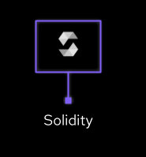

<p align="center">
  
</p>

# 🔭 Introdução 


Esse projeto foi desenvolvido como parte do programa de formação CriptoDev da Gama Academy em parceria com a Blockchain Academy (uma empresa 2TM).

Ele formado por dois `Smart Contracts`, um para criação de um Token baseado no modelo de contrato ERC-20 e um outro contrato de uma Vending Machine, para que os usuário possam comprar e vender tokens. 

Em ambos foi utilizado `Solidity` e disponibilizados na rede de `Rede de Teste Ropsten da Ethereum`.

# 👨‍💻 Integrantes do time 

[Anderson Carneiro Sousa](https://github.com/a-cs)

[Bruno Wilson](https://github.com/BruceJava1001)

[Felipe Geazi](https://github.com/FelipeGeazi)


# ⚙️ Tecnologias utilizadas

[](https://docs.soliditylang.org/en/v0.8.15/)
[](https://hardhat.org/)
[](https://www.chaijs.com/)
[](https://github.com/)
[](https://code.visualstudio.com/)
[](https://web3js.readthedocs.io/en/v1.7.3/)
[](https://getwaffle.io/)
[](https://remix-project.org/)

# 🛠️ Instalação e operação

Clone o repositório do projeto:

```bash
git clone https://github.com/a-cs/gamacoin-cryptodev.git
```

Entre na pasta do repositório criado:

```bash
cd gamacoin-cryptodev
```

Para seguir os passos seguintes é necessário instalar o [Node Js](https://nodejs.org/en/) 

Instale as dependências:

```bash
npm install
```

Compile o código:

```bash
npx hardhat compile
```

Para rodar os testes:

```bash
npx hardhat test
```

# 💻 Funções implementadas:

## 🪙 Token

1. **balanceOf :** Consulta o saldo da carteira. 
2. **totalSupply:**  Verifica a quantidade máxima de tokens disponíveis. 
3. **transfer :** Recebe um valor de amount e um endereço de carteira.E realiza a transferencia de tokens,  no valor do amount para o endereço da carteira  indicado. 
4. **transferFrom:** Recebe dois endereços de carteira e  realiza a transferencia de tokens, da carteira sender para carteira recepient.(Função liberada apenas para o endereço permitido. Ex: o contrato da vending machine)

	 👑 **Funções exercida apenas pelo owner do contrato.**

5. **mint:** Recebe um endereço de carteira e amount, criando tokens no valor de amount no endereço indicado. Além de  aumentar o total supply.
6. **burn:** Recebe um endereço de carteira e amount, destruindo tokens no valor de amount no endereço indicado. Além de  diminuir o total supply.
7. **pausable:** Pausa o contrato. 
8. **activate:** Ativa o contrato
9.  **kill:** Mata o contrato (Função apenas pode ser executada quando o contrato estiver pausado. )
___
## 🏪 Vending Machine

1. **availableSupply:** Retorna quantidade de tokens disponiveis na máquina.
2. **buyingPrice:** Retorna preço atual de compra em wei .
3. **sellingPrice:** Retorna preço atual de venda em wei.
4. **buyTokens:** Recebe o amount de tokens e o value da transação,possibilitando a compra de tokens com ethers. 
5. **sellTokens:** Recebe o amount de tokens e realiza a venda por ether.
   
   👑 **Funções exercida apenas pelo admin do contrato.**
6. **changeBuyPrice:** Recebe o novo preço em wei e o substitui.
7. **changeSellPrice:** Recebe o novo preço em wei e o substitui.
8.  **withdrawEthers:** Saca todo o saldo de ethers do contrato e devolve para a carteira do admin.
9.  **loadTokens:**  O admin irá carregar o amount de tokens no contrato.
10. **loadEthers:** O admin irá carregar o valor da transação no contrato.
11. **kill:** Mata o contrato e saca o saldo de ethers e tokens para o admin.
 ___

# 👌 Testes Token
- Initializing
	- [x] Should return the value passed on the constructor as balance.
	- [x] The initial status should be active
	- [x] The entity that created the contract must be the owner
- Transfer
	- [x] Should only transfer if the status is active
	- [x] Should not be able to send to a non-existent wallet
	- [x] Should not be transferred if the amount is 0
	- [x] Should not be transferred if there is no balance in the wallet
	- [x] Should transfer if there is a balance in the wallet
- TransferFrom
	- [x] Should only transfer if the wallet is allowed
	- [x] Should only transfer if the status is active
	- [x] Should not be able to send to a non-existent wallet
	- [x] Should not be transferred if the amount is 0
	- [x] Should not be transferred if there is no balance in the wallet
	- [x] Should transfer if there is a balance in the wallet
- Mint
	- [x] Should only minted if the status is active
	- [x] The minted value must be greater than 0
	- [x] Only the owner can mint tokens
	- [x] Should not be able to send to a non-existent wallet
	- [x] Should increase totalSupply and wallets balance after mint
- Burn
	- [x] Should only burn if the status is active
	- [x] the wallet must have funds to burn
	- [x] Only the owner can burn tokens
	- [x] Should not be able to send to a non-existent wallet
	- [x] Should decrease totalSupply and wallets balance after burn
- Pausable
	- [x] Should not pause the contract if it is already paused
	- [x] Should not be able to pause the contract if it is not the owner
	- [x] The owner should be able to pause the contract
- Activate
	- [x] Should not pause the contract if it is already actived
	- [x] Should not be able to activate the contract if it is not the owner
	- [x] The owner should be able to activate the contract
- Kill
	- [x] Should not be able to kill if the contract is Active
	- [x] Contract should be dead after kill

___
# 👌 Testes Vending Machine
  - Initializing
  	- [x] should return the values passed on the constructor
  - BuyTokens
  	- [x] should revert if the amount is zero
  	- [x] should revert if the transaction value is lower than the expected
  	- [x] should revert if the availabeSupply is less than the amount
  	- [x] should be able to buy tokens
  - SellTokens
  	- [x] should revert if the amount is zero
  	- [x] should revert if the transaction value is lower than the expected
  	- [x] should be able to sell tokens
  - WithdrawEthers
  	- [x] should revert if not admin
  	- [x] should revert if the machine current balance is 0
  	- [x] should withdraw ethers
  - ChangeSellPrice
  	- [x] should revert if not admin
  	- [x] should revert if the amount is zero
  	- [x] should revert if the amount is equal current price
  	- [x] should revert if the amount is greater than the buying price
  	- [x] should change price
  - ChangeBuyPrice
  	- [x] should revert if not admin
  	- [x] should revert if the amount is zero
  	- [x] should revert if the amount is equal current price
  	- [x] should revert if the amount is less than the selling price
  	- [x] should change price
  - LoadTokens
  	- [x] should revert if not admin
  	- [x] should revert if the amount is zero
  	- [x] should load tokens
  - LoadEthers
  	- [x] should revert if not admin
  	- [x] should revert if the value is zero
  	- [x] should load Ethers
  - Kill
  	- [x] should revert if not admin
  	- [x] should transfer ether and tokens to admin and kill the contract


# 📑 Endereço para acessa os contratos:

### O deploy dos contratos foram na Rede de Teste Ropsten da Ethereum

Token:
[0xe1E14C72Df3DcFDDB178cDd739b4b3F061AcDb30](https://ropsten.etherscan.io/address/0xe1E14C72Df3DcFDDB178cDd739b4b3F061AcDb30)

VendingMachine:
[0xae066340d8628423B21390a310E92176ce27805F](https://ropsten.etherscan.io/address/0xae066340d8628423B21390a310E92176ce27805F)

#  📽️ Apresentação
Link para a [Apresentação](https://docs.google.com/presentation/d/11QQca9wtbKaJ8p2oCyScnEl4yXuibiszd4wjzGiQfBA/edit?usp=sharing)